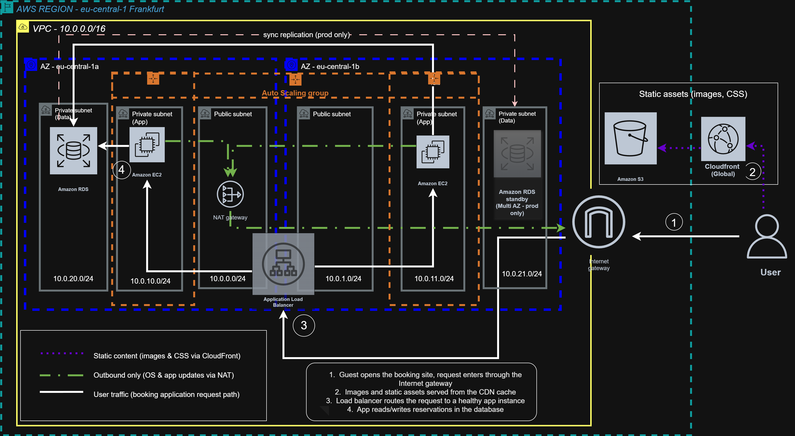

# Adria-Stay

Terraform built AWS infrastructure for a small hospitality business on the Croatian coast. Traffic here is brutally seasonal, ten times more visitors in August than in January. So the whole stack is designed to scale up for the peak without paying peak prices year round. Everything is defined as code: private subnets for guest data, no open SSH ports, and every architectural decision written down as it was made.

🚧 Work in progress — building this in public. Currently in phase 1 of 6.
