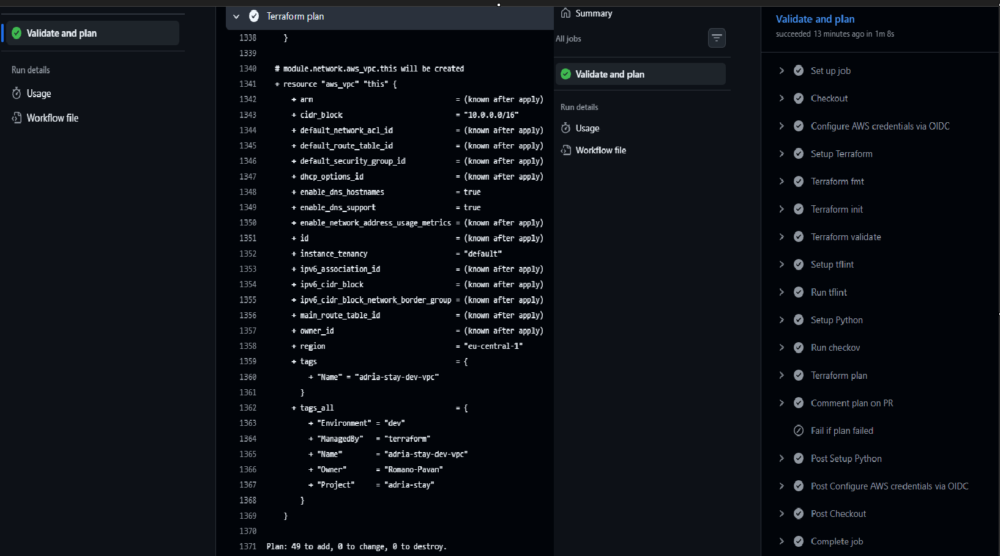

# Adria-Stay

Terraform built AWS infrastructure for a small hospitality business on the Croatian coast. Traffic here is brutally seasonal, ten times more visitors in August than in January. So the whole stack is designed to scale up for the peak without paying peak prices year round. Everything is defined as code: private subnets for guest data, no open SSH ports, and every architectural decision written down as it was made.

## How changes ship

Every change goes through a pull request. GitHub Actions authenticates to
AWS with OIDC federation. No long-lived keys are stored anywhere. 
Runs fmt, validate, tflint, checkov and a plan, and posts the plan as a
comment. The pipeline can read the account and lock the state, but it
cannot change infrastructure: apply stays with a human.

- Policy scanning on every pull request: 225 checks pass, none fail, and the
  27 rules that are waived are waived in one file with the reason written
  next to the resource each one applies to

